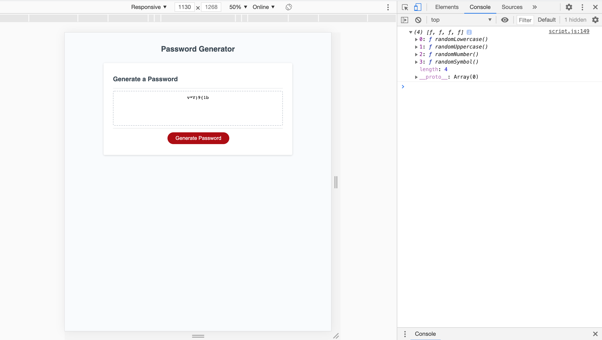

# Password Generator

## Description

We were asked to modify starter code to create an application that enables to randomly generate a password  based on certain criteria that the users selects. 

## What We Did

- Used prompt, confirm and alert features. 
- Applied logics using functions, arrays, conditional statements with logical operators and other javascript fundamentals.
- Added comments to .js file to define the purpose and functionality of various code/declaration. 
- Added a series of prompts for password criteria
- Declaring a limit to the length of the password i.e at least 8 characters and no more than 128 characters
- Created four character types to include in the password (lowercase, uppercase, numeric, and/or special characters).
- Displayed the password to the page. 

## Screenshot

## link To Deployed Application

https://nrasool21.github.io/password-generator/

